# AI 客服辅助 Agent

这是一个面向客服辅助场景的 MVP 项目，包含三部分：

- `backend`：Express + TypeScript 后端 API，负责 AI 调教、人工审核、正式库管理、知识导入、关键词检索、回复生成和回复润色。
- `frontend`：React + Vite + Ant Design 管理后台，用于维护知识库、规则、话术、风险提示、人设和审核流程。
- `chrome-extension`：Chrome MV3 Side Panel 扩展，用于在客服工作页面旁生成/润色回复、检索知识库，并把选中的话术填入页面输入框。

项目当前使用本地 CSV/JSON 文件持久化，未接入数据库。核心数据位于 `backend/data/`。

## 功能概览

- AI 调教：支持自然语言、历史聊天记录、业务规则输入，生成知识、规则、话术和风险提示建议。
- 文件学习：支持上传 `.txt`、`.csv`、`.json`、`.log` 聊天记录，自动生成待审核条目。
- 人工审核：待审核条目可查看、编辑 JSON、单条通过/拒绝，也支持批量通过/拒绝。
- 正式库管理：管理知识库、规则库、话术库、风险提示库，支持启用/停用；知识库支持分类管理和分类重命名。
- 知识库导入：支持导入 `huashu.csv` 格式文件，生成待审核知识条目，可选择 AI 优化。
- 关键词检索：支持检索知识库内容和自定义关键词话术映射，映射可新增、编辑、删除并设置优先级。
- 人设配置：维护客服回复人设、语气、风格规则和禁用表达。
- 回复测试：基于已启用的正式库和人设生成客服推荐回复，并展示命中依据和风险提示。
- Chrome 扩展：在浏览器侧边栏中手动生成推荐回复、润色草稿、检索知识库，支持选中/复制/填入话术。

## 界面预览

### 管理后台首页

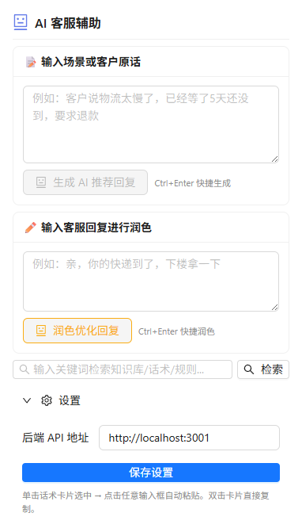

### AI 调教

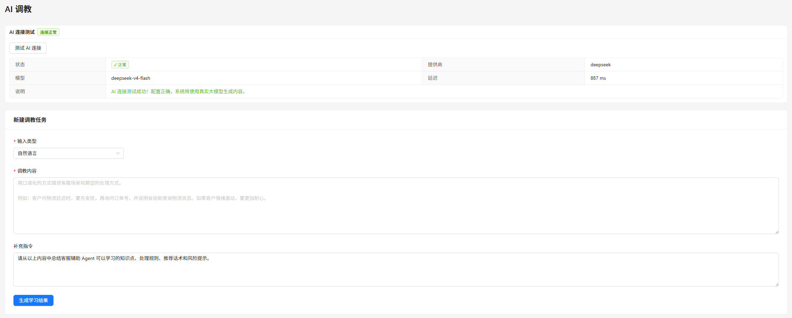

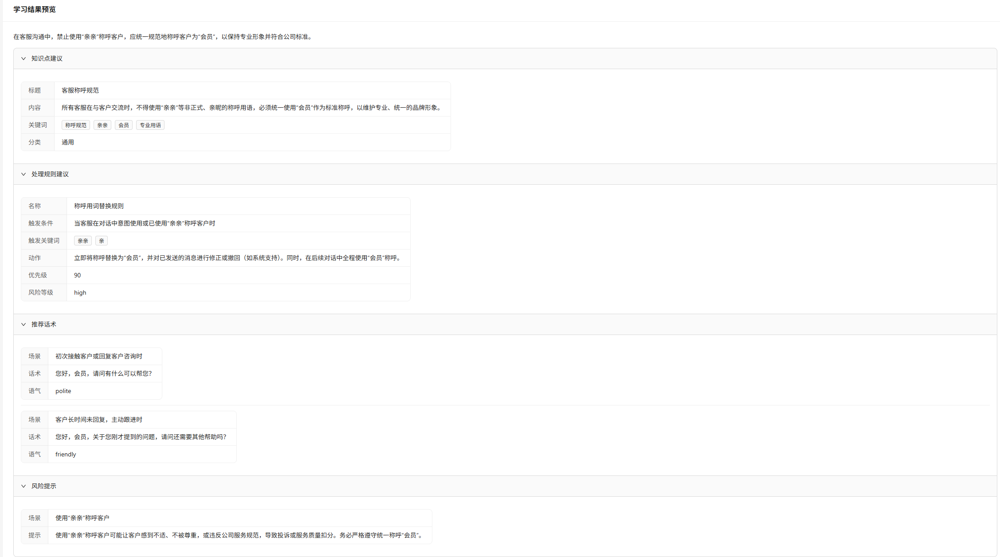

### 人工审核

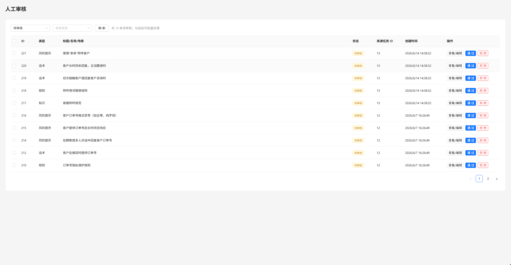

### 正式库管理

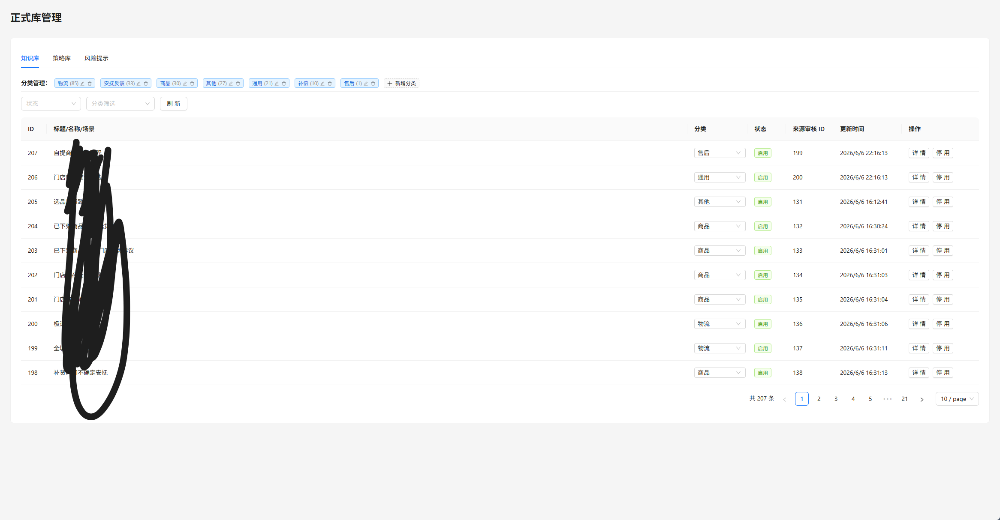

### 人设管理

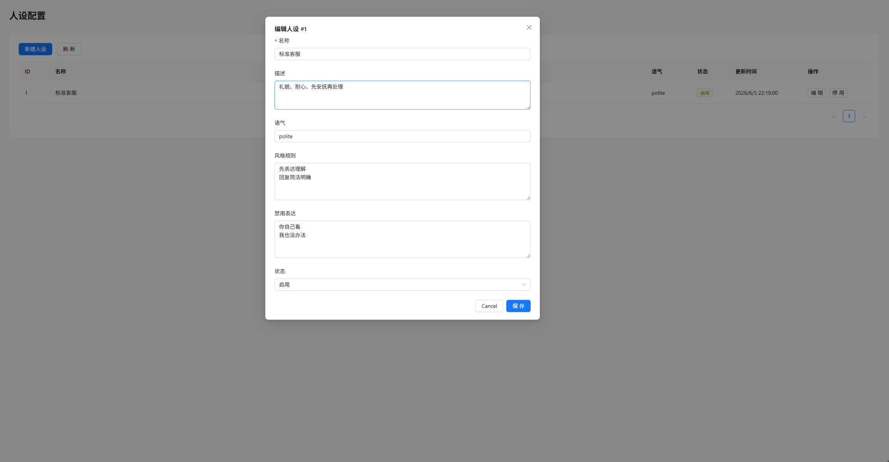

### AI 回复测试

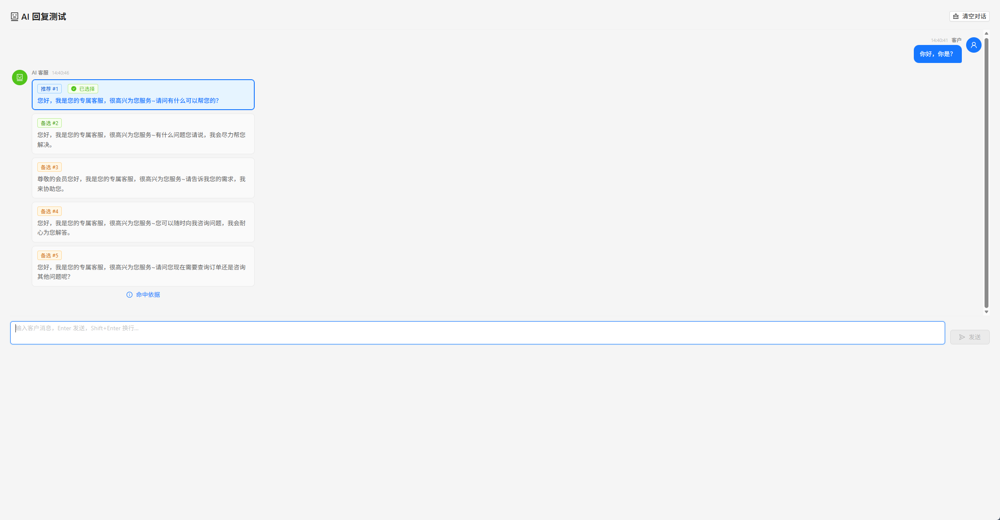

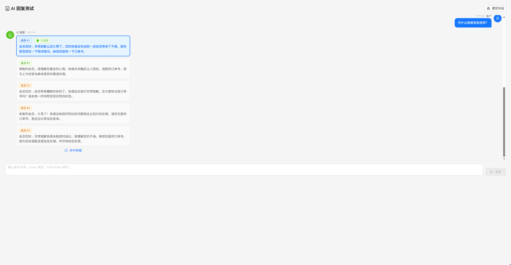

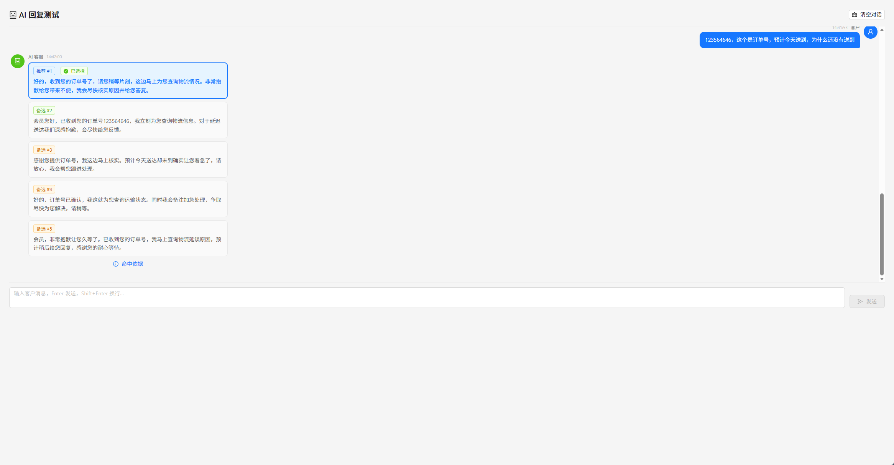

### 知识库导入与检索

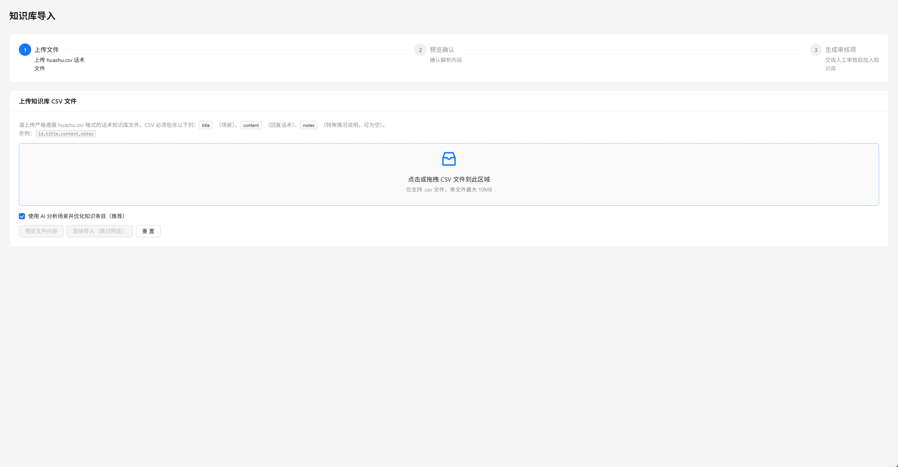

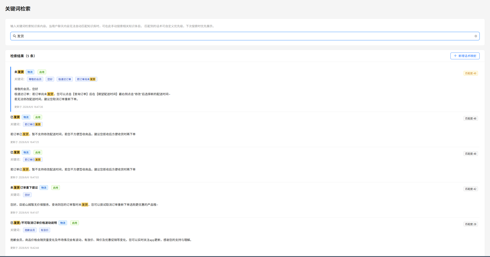

## 目录结构

```text
ai-customer-agent/
  docs/
    images/
  backend/
    data/
      knowledge_base_items.csv
      knowledge_categories.csv
      keyword_mappings.json
      learning_tasks.csv
      persona_configs.csv
      review_items.csv
      risk_tips.csv
      rule_items.csv
      script_items.csv
    src/
      routes/
      services/
      utils/
      index.ts
      types.ts
    .env.example
    package.json
  frontend/
    src/
      api/
      components/
      pages/
      App.tsx
      main.tsx
    .env.example
    package.json
  chrome-extension/
    src/
      background/
      content/
      sidepanel/
      types/
    icons/
    manifest.json
    package.json
  README.md
```

## 环境要求

- Node.js 20+
- npm 10+
- Chrome 或 Chromium 浏览器（仅扩展端需要）

## 后端启动

```bash
cd backend
npm install
copy .env.example .env
npm run dev
```

默认地址：

```text
http://localhost:3001
```

健康检查：

```http
GET /api/health
```

`.env` 示例：

```env
PORT=3001
FRONTEND_ORIGIN=http://localhost:5173
AI_PROVIDER=mock
AI_API_KEY=
AI_API_BASE_URL=
AI_MODEL=
```

未配置真实 `AI_API_KEY` 时默认使用 Mock AI，系统可离线运行基础流程。

如果 Windows PowerShell 提示禁止加载 `npm.ps1`，可把命令中的 `npm` 改成 `npm.cmd`，例如 `npm.cmd run dev`。

## 管理后台启动

```bash
cd frontend
npm install
copy .env.example .env
npm run dev
```

默认地址：

```text
http://localhost:5173
```

主要页面：

- `/learning`：AI 调教与文件学习。
- `/reviews`：人工审核。
- `/libraries`：正式库管理。
- `/personas`：客服人设配置。
- `/reply-test`：AI 回复测试。
- `/knowledge-import`：知识库 CSV 导入。
- `/knowledge-search`：关键词检索与自定义话术映射。

## Chrome 扩展启动

```bash
cd chrome-extension
npm install
npm run build
```

然后在 Chrome 中打开 `chrome://extensions`：

1. 开启「开发者模式」。
2. 点击「加载已解压的扩展程序」。
3. 选择 `chrome-extension/dist` 目录。
4. 确认后端已运行在 `http://localhost:3001`。

扩展会打开 Side Panel，支持：

- 输入客户原话或场景，生成推荐回复。
- 输入客服草稿，生成多个润色版本。
- 检索知识库、规则、话术、风险提示。
- 单击话术选中，双击复制；选中后可填入输入框。
- 在设置中修改后端 API 地址。

## 知识库导入格式

`/knowledge-import` 支持上传 CSV，必须包含场景和话术列：

```csv
id,title,content,notes
1,物流延迟,亲亲，非常抱歉让您久等了，我先帮您核实物流情况。,适用于物流长时间未更新
```

也支持中文列名：

```csv
id,场景,话术,特殊情况说明
1,退款进度,您好，我这边帮您查询退款进度，请稍等。,适用于客户催退款
```

导入后不会直接写入正式知识库，而是生成待审核条目；审核通过后才写入 `knowledge_base_items.csv`。

## API 列表

```http
GET    /api/health

GET    /api/learning
GET    /api/learning/:id
POST   /api/learning/generate
POST   /api/learning/upload

GET    /api/review-items
GET    /api/review-items/:id
PUT    /api/review-items/:id
POST   /api/review-items/:id/approve
POST   /api/review-items/:id/reject
POST   /api/review-items/batch

GET    /api/libraries/:type
GET    /api/libraries/:type/:id
PATCH  /api/libraries/:type/:id/status
GET    /api/libraries/knowledge/categories
POST   /api/libraries/knowledge/categories
PUT    /api/libraries/knowledge/categories
GET    /api/libraries/knowledge/search?q=物流&limit=5
PATCH  /api/libraries/knowledge/:id/category

GET    /api/personas
POST   /api/personas
GET    /api/personas/:id
PUT    /api/personas/:id
PATCH  /api/personas/:id/status

POST   /api/reply/generate
POST   /api/reply/polish
POST   /api/reply-test/generate

GET    /api/search?keyword=物流
POST   /api/knowledge-import/preview
POST   /api/knowledge-import/upload

GET    /api/keyword-mappings
GET    /api/keyword-mappings/search?keyword=物流
POST   /api/keyword-mappings
PATCH  /api/keyword-mappings/:id
DELETE /api/keyword-mappings/:id

POST   /api/ai/test
```

`type` 可选：

```text
knowledge | rule | script | risk_tip
```

所有 API 默认返回统一格式：

```json
{
  "success": true,
  "data": {}
}
```

错误格式：

```json
{
  "success": false,
  "error": {
    "message": "错误信息"
  }
}
```

## AI 配置

### Mock AI

默认配置为：

```env
AI_PROVIDER=mock
AI_API_KEY=
```

Mock 模式会根据关键词生成固定结构的学习结果、回复结果和润色结果，适合本地开发和演示。

### Anthropic Claude

```env
AI_PROVIDER=anthropic
AI_API_KEY=sk-ant-xxx
AI_MODEL=claude-sonnet-4-6
```

### OpenAI

```env
AI_PROVIDER=openai
AI_API_KEY=sk-xxx
AI_MODEL=gpt-4o
```

### DeepSeek

```env
AI_PROVIDER=deepseek
AI_API_KEY=sk-xxx
AI_MODEL=deepseek-chat
```

### OpenAI 兼容接口

```env
AI_PROVIDER=openai
AI_API_KEY=your-key
AI_API_BASE_URL=https://your-custom-endpoint/v1
AI_MODEL=your-model
```

AI 调用集中在 `backend/src/services/ai.service.ts`，可继续扩展其他模型供应商。

## 常用验证命令

后端：

```bash
curl http://localhost:3001/api/health
curl -X POST http://localhost:3001/api/learning/generate \
  -H "Content-Type: application/json" \
  -d "{\"inputType\":\"natural_language\",\"content\":\"客户问物流延迟时，要先安抚，再询问订单号。\"}"
curl "http://localhost:3001/api/review-items?status=pending"
curl -X POST http://localhost:3001/api/reply-test/generate \
  -H "Content-Type: application/json" \
  -d "{\"customerMessage\":\"我的快递怎么还没到，物流也不更新。\"}"
curl -X POST http://localhost:3001/api/ai/test
```

构建：

```bash
cd backend
npm run build
cd ../frontend
npm run build
cd ../chrome-extension
npm run build
```

## 数据与持久化

- 后端数据文件在 `backend/data/`。
- CSV/JSON 会在服务读写时自动创建或更新。
- 该项目没有数据库迁移流程，也没有 Prisma/SQLite 依赖。
- `node_modules/`、`dist/`、日志文件和本地 `.env` 不应提交到仓库。
